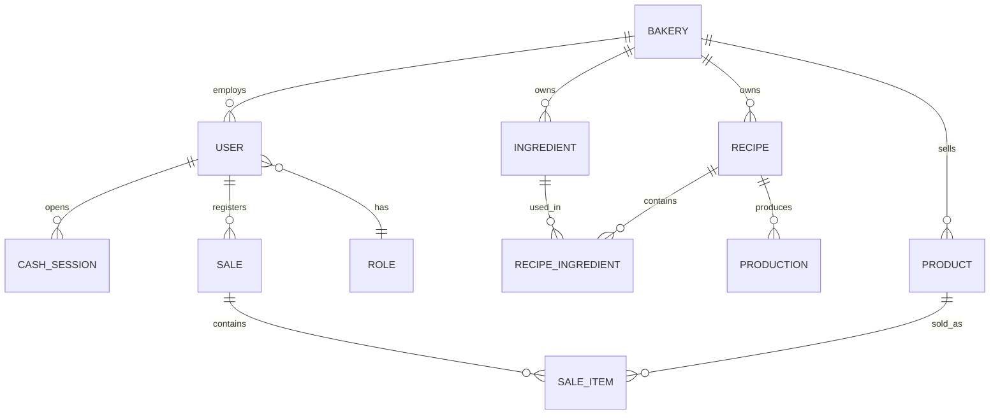

# MER — Fundação do Padaria dos Sonhos ERP

## Entidades

## Decisões
- Nesta primeira versão, o domínio começa com uma padaria; `BAKERY` já é reservado para a futura separação multiempresa.
- Usuários possuem um papel principal e a autorização será centralizada em middleware.
- Valores monetários serão armazenados em centavos e quantidades com precisão decimal no Prisma/PostgreSQL.
- Estoque será auditável através de movimentos, nunca alterado sem histórico.

## Próxima migração Prisma
As tabelas previstas são `Bakery`, `User`, `Role`, `Ingredient`, `Supplier`, `Recipe`, `RecipeIngredient`, `Product`, `Production`, `StockMovement`, `Sale`, `SaleItem`, `Payment`, `CashSession`, `Expense` e `Customer`.